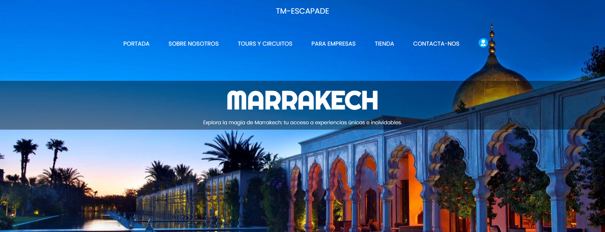
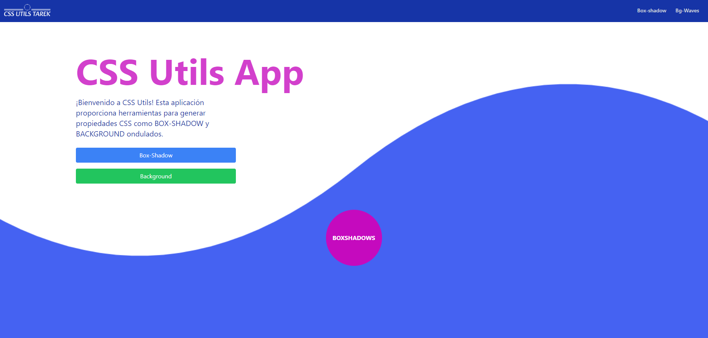
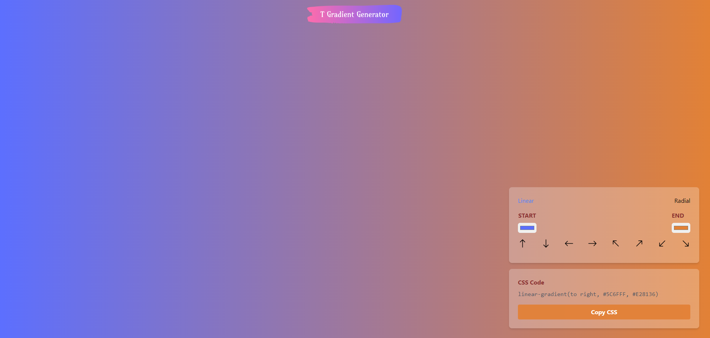

# Portafolio de [Tu Nombre]

¡Bienvenido a mi portafolio! Este es un espacio donde puedes conocer más sobre mí, mis habilidades, proyectos y experiencia laboral.

## Acerca de mí

Soy Tarek Zemmari, un apasionado del desarrollo web con experiencia en tecnologías como React, Node.js PHP y más. Me encanta crear aplicaciones web que sean intuitivas, atractivas y funcionales.

## Proyectos destacados

# Algunos de mis Proyectos

## TM-Escapade

TM-Escapade es una aplicación web de agencia de viajes desarrollada en PHP y Metronic como administrador. Destaca por su enfoque en la experiencia del usuario y la facilidad de navegación.

- **Código Fuente:** [GitHub](https://github.com/T-zemmari/tm_escapade.git)
- **Demo en Vivo:** (no disponible)

## CSS Utils

CSS Utils es una aplicación en React + Tailwind para generar propiedades CSS personalizadas como box-shadows y fondos ondulados.

- **Código Fuente:** [GitHub](https://github.com/T-zemmari/css_utils.git)
- **Demo en Vivo:** [Ver Demo](https://t-zemmari.github.io/css_utils)

## TGG - T Gradient Generator

TGG es una aplicación web en React + Tailwind para crear gradientes CSS personalizados con colores y direcciones específicas. Fácil de usar y con código CSS generado automáticamente.

- **Código Fuente:** [GitHub](https://github.com/T-zemmari/t_gradient_generator.git)
- **Demo en Vivo:** [Ver Demo](https://t-zemmari.github.io/t_gradient_generator/)

